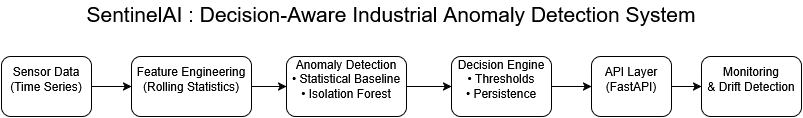

# SentinelAI

## System Architecture



## System Architecture


## Problem Statement
Industrial equipment generates continuous sensor data. Undetected anomalies can lead to
unplanned downtime, safety risks, and high operational costs. Traditional threshold-based
monitoring often produces false alarms or misses early failure signals.

SentinelAI addresses this by providing a decision-aware anomaly detection system designed
for industrial environments.

---

## System Overview
SentinelAI is an end-to-end industrial AI system for detecting anomalies and estimating
failure risk from time-series sensor data. The system emphasizes robustness, interpretability,
and decision logic over raw model accuracy.

Key characteristics:
- End-to-end ML pipeline
- Explicit failure simulation
- Decision-aware alerting
- API-based system integration
- Monitoring and drift awareness

---

## Architecture
The system is structured as modular components:

- **Data Ingestion** – load sensor time-series data
- **Failure Injection** – simulate realistic industrial faults
- **Feature Engineering** – rolling statistical features
- **Anomaly Detection**
  - Statistical baseline
  - Isolation Forest (ML)
- **Decision Engine** – suppress noise and false alarms
- **Monitoring** – detect data drift
- **API Layer** – expose results for system integration

---

## CRISP-DM Mapping
1. **Business Understanding**  
   Reduce downtime and avoid costly false positives.

2. **Data Understanding**  
   Sensor noise, drift, missing values, and failure patterns.

3. **Data Preparation**  
   Sliding windows, normalization, feature extraction.

4. **Modeling**  
   Baseline statistical model and Isolation Forest.

5. **Evaluation**  
   False alarm rate, anomaly persistence, detection robustness.

6. **Deployment**  
   REST API, reproducible environment, monitoring hooks.

---

## Decision Logic
Unlike many ML projects that output raw predictions, SentinelAI converts anomaly scores
into actionable decisions.

Key ideas:
- Alerts require persistence across multiple windows
- Confidence thresholds suppress noisy signals
- False positives are treated as a primary risk

---

## Failure Injection Strategy
To test robustness, synthetic failures are injected into sensor data:

- Gradual overheating
- Sudden vibration spikes
- Long-term sensor drift

This enables controlled testing of detection behavior under realistic failure scenarios.

---

## API Interface
The system exposes a REST API using FastAPI.

Example response:
```json
{
  "risk_level": "HIGH",
  "anomaly_score": 0.82,
  "confidence": 0.91,
  "model_version": "v1.0.0",
  "recommended_action": "inspect equipment immediately"
}

